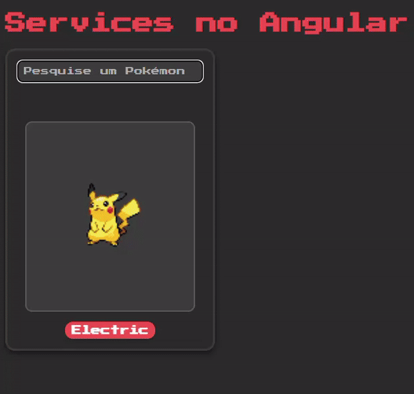

# Angular Services

Este repositório contém exemplos de como utilizar Services no Angular, incluindo a criação de services, injeção de dependências, uso do módulo HttpClient, trabalho com observables e como usar o método `subscribe`.

## Índice

- [O que são Services?](#o-que-são-services)
- [Criando um Service](#criando-um-service)
- [Injetando um Service](#injetando-um-service)
- [Utilizando HttpClientModule](#utilizando-httpclientmodule)
- [Trabalhando com Observables](#trabalhando-com-observables)
- [Usando Subscribe](#usando-subscribe)
- [Exemplo Prático](#exemplo-prático)
- [Projeto - Card Pokémon](#projeto---card-pokémon)

## O que são Services?
Services são uma maneira de compartilhar código e lógica entre diferentes componentes do Angular. Eles são geralmente usados para realizar operações como chamadas HTTP, manipulação de dados e outras tarefas que precisam ser reutilizadas em vários lugares da aplicação.


## Criando um Service

Para criar um Service no Angular, utilize o comando CLI:
```bash
ng generate service nome-do-service
```

## Injetando um Service

Para injetar um service em um componente, você deve fazer isso através do construtor do componente:

```typescript
import { Component } from '@angular/core';
import { NomeDoService } from './nome-do-service.service';

@Component({
  selector: 'app-exemplo',
  templateUrl: './exemplo.component.html'
})
export class ExemploComponent {

  constructor(private nomeDoService: NomeDoService) { }

}
```

## Utilizando HttpClientModule
O módulo `HttpClientModule` é necessário para realizar chamadas HTTP no Angular. Primeiro, você deve importar o módulo no seu `AppModule`:

```typescript
import { HttpClientModule } from '@angular/common/http';

@NgModule({
  declarations: [
    AppComponent,
    ...
  ],
  imports: [
    HttpClientModule,
    ...
  ],
  providers: [],
  bootstrap: [AppComponent]
})
export class AppModule { }
```

Agora você pode usar o `HttpClient` dentro dos seus services:

```typescript
import { Injectable } from '@angular/core';
import { HttpClient } from '@angular/common/http';
import { Observable } from 'rxjs';

@Injectable({
  providedIn: 'root'
})
export class NomeDoService {

  private apiUrl = 'https://api.exemplo.com/data';

  constructor(private http: HttpClient) { }

  getData(): Observable<any> {
    return this.http.get<any>(this.apiUrl);
  }

}
```

## Trabalhando com Observables
Observables são usados no Angular para lidar com operações assíncronas, como chamadas HTTP. Eles permitem que você reaja a eventos ou resultados à medida que eles ocorrem.

No exemplo acima, o método `getData` retorna um `Observable` que você pode subscrever em um componente.

## Usando Subscribe
Para consumir os dados de um `Observable`, você deve utilizar o método `subscribe`:

```typescript
this.nomeDoService.getData().subscribe(data => {
  console.log(data);
}, error => {
  console.error('Erro:', error);
});
```

O método `subscribe` pode aceitar até três funções: uma para manipular os dados emitidos, outra para lidar com erros, e uma terceira opcional para manipular a conclusão da sequência.


## Exemplo Prático
Aqui está um exemplo completo utilizando os conceitos acima:

```typescript
import { Component, OnInit } from '@angular/core';
import { NomeDoService } from './nome-do-service.service';

@Component({
  selector: 'app-exemplo',
  templateUrl: './exemplo.component.html'
})
export class ExemploComponent implements OnInit {

  dados: any;

  constructor(private nomeDoService: NomeDoService) { }

  ngOnInit() {
    this.nomeDoService.getData().subscribe(
      (response) => {
        this.dados = response;
      },
      (error) => {
        console.error('Erro ao obter dados:', error);
      }
    );
  }

}
```

## Projeto - Card Pokémon

Este projeto é uma demonstração prática dos conceitos de `services` no Angular, utilizando a [PokeAPI](https://pokeapi.co/) para simular um Card de Pokémon. O Card exibe informações como o nome, a imagem e os tipos dos Pokémons de maneira dinâmica e estilizada.


<p align="center">
  
</p>

Caso queira conferir o código completo, acesse a [pasta no diretório](https://github.com/joschonarth/dio-angular/tree/main/09-services/services-project). Fique a vontade para utilizar e rodar o projeto você mesmo.